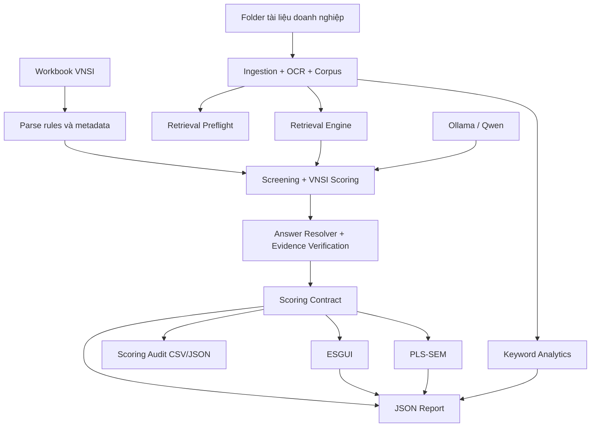

# Luồng Hoạt Động Của Hệ Thống ESG

Pipeline hiện tại không còn là một luồng “PDF -> LLM -> điểm” đơn giản. Hệ thống vận hành theo chuỗi: parse rules, ingestion, retrieval preflight, retrieval/question answering, scoring, audit, rồi mới kết xuất report.

## Sơ Đồ Luồng Dữ Liệu

## Các Giai Đoạn

### [Phase 0] Parse Rules Và Metadata
- Hệ thống đọc workbook VNSI để tạo:
  - screening rules,
  - scoring rules,
  - metadata hỗ trợ retrieval theo loại câu hỏi, option, time policy.
- Các artifact này được ghi ra `outputs/*.json` để tái sử dụng.
- Đây là bước quan trọng vì nhiều hành vi phía sau không còn hard-code, mà đi theo metadata:
  - câu nào là multi-select,
  - câu nào cho phép dùng tài liệu lịch sử,
  - câu nào phải đúng target year,
  - option nào là dấu hiệu âm tính hoặc dương tính.

### [Phase 1] Ingestion Và Xây Dựng Corpus
- PDF text được đọc trực tiếp nếu có text layer.
- Với PDF scan, hệ thống OCR rồi cache kết quả.
- Nếu file đầu vào nằm trong dossier công ty, hệ thống có thể nạp toàn bộ folder tài liệu liên quan, bao gồm cả tài liệu lịch sử, vì nhiều câu hỏi cho phép historical evidence.
- Corpus sau đó được chuẩn hóa thành các document/section có metadata file, page, type, year.
- Đây là nền để report cuối có thể trích dẫn lại đúng file và trang.

### [Phase 2] Retrieval Preflight
- Chạy kiểm tra nhanh chất lượng retrieval trước khi chấm điểm toàn bộ.
- Sinh artifact trong `outputs/audit/*_retrieval_preflight.*`.
- Cache preflight phụ thuộc fingerprint của bộ tài liệu, metadata và retrieval window.
- Nếu fingerprint thay đổi do:
  - thêm/bớt file,
  - đổi nội dung file,
  - đổi timestamp đủ để hash đầu vào đổi,
  thì preflight sẽ chạy lại.

### [Phase 3] Retrieval + LLM Extraction
- Với từng câu hỏi, retrieval chọn các section liên quan nhất.
- LLM chỉ nhận context đã rút gọn, không đọc toàn bộ corpus.
- Nếu LLM trả JSON lỗi, rỗng, hoặc chỉ có `<think>`, hệ thống:
  - phân loại lỗi,
  - retry với context/schema gọn hơn,
  - dùng fallback retrieval-grounded trong các trường hợp đủ an toàn.
- Retry ladder hiện đi theo logic giảm tải dần:
  1. context đầy đủ + schema đầy đủ
  2. nửa context
  3. nửa context + schema tối giản
  4. answer-only schema ngắn
- Mục tiêu là phân biệt 2 loại vấn đề:
  - model thật sự không trả được completion cuối,
  - model có trả nhưng JSON bẩn hoặc không ổn định.

### [Phase 3A] Fallback Khi LLM Không Tin Cậy

- Với multi-select:
  - nếu LLM fail nhưng retrieval có option-level evidence đủ rõ, hệ thống có thể dựng `option_evidence` từ retrieval.
- Với single-select:
  - chỉ fallback khi có một option dương trội rõ,
  - không dùng fallback bừa cho case mơ hồ hoặc xung đột.
- Với numeric questions:
  - `NumericExtractor` có thể override trong một số trường hợp đủ điều kiện.

### [Phase 4] Resolution Và Scoring
- `AnswerResolver` đánh dấu câu là:
  - `supported`,
  - `weakly_supported`,
  - `insufficient`.
- `ScoringEngine` chỉ công nhận điểm dương khi có evidence hợp lệ.
- `score_100` được tính trực tiếp từ:
  - `raw_total_after_penalties / raw_max * 100`
- Không còn nhân trọng số ngành E/S/G.
- Nếu answer dương nhưng không có evidence đủ dùng, điểm dương sẽ không được giữ.
- Nếu evidence có nhưng verifier cho rằng không grounded, câu sẽ bị hạ về `weakly_supported` và thường không giữ điểm dương.

### [Phase 5] Audit Và Report
- Hệ thống sinh:
  - report JSON tổng,
  - scoring audit CSV/JSON,
  - clean markdown report,
  - review list và diagnostics.
- Mỗi câu có thể đi kèm:
  - `reason`,
  - `evidence_items`,
  - `evidence_source_ref`,
  - `top_source_refs`,
  - `source_sections`.
- `evidence_items` là lớp quan trọng nhất để đọc citation chi tiết.
- `evidence_source_ref` và `top_source_refs` là citation ngắn để audit nhanh.

### [Phase 5A] Các Tầng Output

1. **Progress cache**
   - phục vụ resume
   - không phải đầu ra đọc cho người dùng cuối

2. **Report JSON**
   - đầy đủ nhất
   - chứa `scoring_details`, `diagnostics`, `retrieval_preflight`, `review lists`

3. **Scoring audit**
   - gọn hơn
   - phù hợp lọc nhanh câu nào mất điểm, thiếu evidence, hoặc fallback

4. **Clean markdown**
   - dễ đọc hơn
   - nhưng có thể không phản ánh đầy đủ tất cả citation edge cases như JSON report

### [Phase 6] Analytics Phụ Trợ
- Keyword analytics
- ESGUI
- PLS-SEM

## Cơ Chế Chống Mất Tiến Độ

- Sau mỗi câu hỏi, scorer tự lưu progress cache bằng ghi file tạm rồi thay thế atomically.
- Nếu tiến trình dừng giữa chừng, có thể resume từ `outputs/cache/*_scoring_progress.json`.
- Report tổng `outputs/reports/*_esg_report.json` chỉ được ghi ở cuối pipeline, nên nếu job chưa hoàn tất thì thường chỉ có progress cache và audit trung gian.
- Nghĩa là:
  - job bị dừng không đồng nghĩa mất sạch kết quả,
  - nhưng cũng không đồng nghĩa report cuối đã tồn tại.
